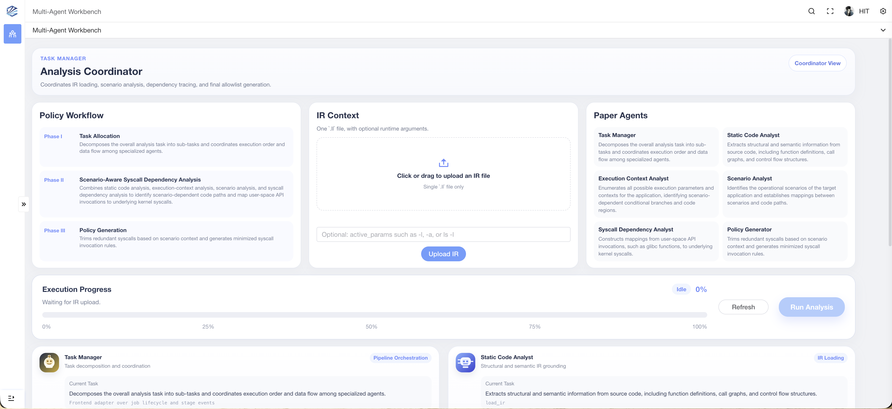
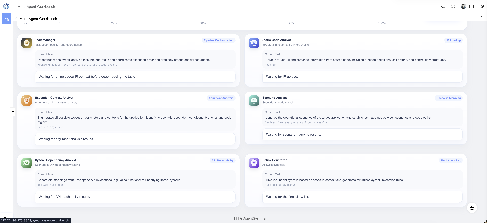

<p align="center">
  <h1 align="center">AgentSysFilter</h1>
  <p align="center">
    Scenario-aware multi-agent static analysis tool for Linux syscall filtering.
  </p>
</p>

<p align="center">
  <a href="#"></a>
  <a href="#"></a>
</p>

<p align="center">
  <a href="#quick-start">Quick Start</a> ·
  <a href="#demo">Demo</a> ·
  <a href="#usage">Usage</a> ·
  <a href="#output">Output</a>
</p>

## Overview

AgentSysFilter is a scenario-aware multi-agent static analysis tool for generating syscall limitation strategies for Linux applications.

Given an application's LLVM IR and a target service scenario, AgentSysFilter uses LLM-driven agents to analyze scenario-specific execution paths, identify reachable libc/POSIX APIs, map them to kernel syscalls, and produce a syscall set that can be used to construct allow lists or seccomp profiles.

## Highlights

- **Scenario-aware analysis**: generates syscall results for a specific service scenario instead of one coarse global profile.
- **LLVM IR based workflow**: analyzes functions, call edges, CFG reachability, and external API dependencies from LLVM IR.
- **LLM-driven multi-agent pipeline**: decomposes the analysis into task orchestration, static analysis, execution-context reasoning, API tracing, and policy generation.
- **Live web workbench**: uploads IR files, starts analysis jobs, streams stage progress, and displays agent outputs in the browser.
- **Syscall-ready output**: maps reachable libc/POSIX APIs to Linux syscalls for allow-list or seccomp profile construction.

## Demo

<p align="center">
  
</p>

<p align="center">
  
</p>

## Quick Start

### 0. Requirements

- Linux or WSL
- Python 3.11
- LLVM/Clang 20, `llvm-config`, CMake, and a C++ compiler
- Node.js 18+ and pnpm 9+
- A DeepSeek/OpenAI-compatible API key

On Ubuntu/Debian:

```bash
sudo apt update
sudo apt install -y python3 python3-venv python3-pip cmake build-essential llvm clang llvm-dev nlohmann-json3-dev
corepack enable
corepack prepare pnpm@latest --activate
```

### 1. Configuration

Create the backend configuration file:

```bash
git clone https://github.com/gresces/AgentSysFilter.git
cd AgentSysFilter
cp .env.example .env
```

Edit `.env` and set your API key.

### 2. Backend Setup

Build the LLVM analysis backend with CMake:

```bash
cd ASRS/llvm_service
cmake -S . -B build -DLLVM_DIR="$(llvm-config --cmakedir)" -DCMAKE_BUILD_TYPE=Release
cmake --build build
```

Install the Python backend dependencies:

```bash
cd ASRS
python3 -m venv .venv
.venv/bin/pip install -r requirements.txt
```

### 3. Frontend Setup

Install and build the frontend:

```bash
cd ASRS/frontend
pnpm install && pnpm build
```

For development, use:

```bash
cd ASRS/frontend
pnpm install && pnpm dev
```

The development server runs at `http://127.0.0.1:8848`.

## Run

Start the LLVM IR analysis daemon:

```bash
cd ASRS
./llvm_service/build/asrs-ird
```

In a second terminal, start the FastAPI backend:

```bash
cd ASRS
.venv/bin/python -m uvicorn app:app --host 0.0.0.0 --port 8000
```

Check that the backend is running:

```bash
curl http://127.0.0.1:8000/health
```

Expected output: `{"status":"ok"}`.


## Usage

Open the frontend:

```text
http://127.0.0.1:8848
```

Then:

1. Upload one LLVM IR file with the `.ll` suffix.
2. Enter the target service scenario, for example `-n -v`.
3. Start the analysis.
4. Inspect the multi-agent workflow and the generated syscall result.

For multi-call binaries such as BusyBox or Toybox, put the applet name first:

```text
cat -n
```

## Command-Line Usage

AgentSysFilter can also be run from the command line for debugging:

```bash
cd ASRS
.venv/bin/python run_analysis.py /path/to/program.ll -n -v
```

## Output

The analysis pipeline produces:

- scenario-aware argument and execution-context analysis results;
- reachable libc/POSIX API sets;
- mapped syscall sets;
- data that can be used to construct syscall allow lists or seccomp profiles.
